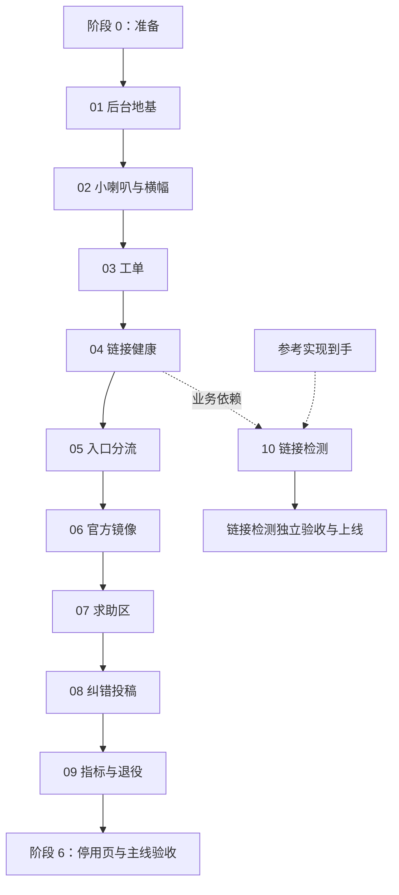

# 运营层重构总计划

状态：总计划草稿，2026-09-08 更新模块文档。实施顺序与模块边界沿用已确认的[第 8 份实施编排](../8.operations-layer-rollout-plan.md)；产品规则以[运营层设计基线](../7.operations-layer-redesign.md)为依据。本文把编排落实为任务、依赖、代码落点、验证和上线条件，供逐阶段执行。本文的技术细化是实施建议，尚待决定的事项集中在第 9 节。

仓库核对基点：`50ad20d6`。模块 01 至 10 各提供 PM 版与实施计划，共 20 份，索引见第 3.2 节。文件存在、文档审阅完成、产品决定定稿、功能上线分别记录，不能互相代替。本轮只编写和审阅文档，不实施功能、不执行实验或迁移、不部署，也不暂存或提交 Git 变更；生产公告、数据库与线上功能状态未核实。

## 1. 目标与执行边界

目标是让常规资源问题由机制与发布者处理，让运行、下载、解压问题进入社区求助，站方集中处理规则、官方链接与升级事项。最终以「机制层与责任层消化的事务占比」及站方队列的积压、等待时长判断效果，对应基线第 1、2、10 节。

执行沿用以下已确认约束：

- 阶段顺序为准备 → 后台地基与沟通 → 工单与链接健康 → 官方镜像 → 求助区 → 纠错投稿 → 指标与收尾。阶段 1 先完成并上线模块 01，再开始模块 02。
- 本轮一次补齐十个模块的两种视角，使用相同任务与实验编号互相对应。PM 版说明目标、流程、范围、依赖、里程碑、验收与未决事项；实施计划沿用第 8 份实施编排第 7 节的十二项模板。文档可以提前完成，实际开发与上线仍按下述顺序推进；每模块依赖的产品决定定稿后才实施，结果再次验收。
- 每阶段交付能完整使用的能力。代码可以分批提交，公开入口的启用必须与对应数据、权限、写入和查询能力一起交付。
- 前台延续 HeroUI v2，后台使用独立根布局与样式入口的 shadcn；新业务集中到新目录、新 schema 文件，修改既有写入点时列出影响范围。
- 保持现有四级角色。后台队列逐步统一到管理员级，封禁、删条目、站点设置、群发邮件等沿用超级管理员边界。
- [会社获取独立线](../9.company-ingestion-track.md)不占本计划的排期，也不是前置。模块 01 保留会社歧义的既有逻辑与文案；模块 08 的载荷排除会社、开发商、社团字段。
- 受理范围与预计首次响应说明沿用基线第 8.6 节，随将来的站点文档统一编写，不新增模块或独立页面。模块 05、07 上线时先在入口内提供一句话提示，内容对应当时已上线的能力。
- 规模沿用 S、M、L、XL，表示相对投入，不承诺日历工期。模块 10 等参考实现到手后评估，不能阻塞其他模块收尾。

## 2. 仓库基点与需要修正的实现前提

以下是本次通过 fast-context 定位、再读取源码核实的事实。路径均为迁移前路径；模块 01 完成后，页面路径按实际路由组位置更新，API 与业务组件路径不因页面搬迁而默认改变。

| 范围       | 当前事实与复用入口                                                                                                                                                                                                                                                                       | 对总计划的影响                                                                                                         |
| ---------- | ---------------------------------------------------------------------------------------------------------------------------------------------------------------------------------------------------------------------------------------------------------------------------------------- | ---------------------------------------------------------------------------------------------------------------------- |
| 版本       | [package.json](../../package.json)：Next.js `15.5.18`、HeroUI `2.8.1`；React `^19.2.3`、Tailwind `^4.1.11`、Prisma 与 adapter `^7.8.0`、node-cron `^4.2.1`、Vitest `^4.0.15`                                                                                                             | 文档按现有主版本落实；带 `^` 的值是声明范围，实施前从 lockfile 核对实际版本。框架升级不作为运营层前置                  |
| 布局与样式 | [app/layout.tsx](../../app/layout.tsx)加载前台 Provider、站点外壳与 [styles/index.css](../../styles/index.css)；后者导入 tailwind、blog、prose、editor、themes，并含全局字体 `!important`。其中 [styles/tailwind.css](../../styles/tailwind.css)加载 HeroUI 插件，当前没有前后台扫描边界 | 模块 01 要验证完整样式导入链、Provider、CSS 扫描和打包边界；控制台不复用前台全局入口                                   |
| 后台       | [app/admin/layout.tsx](../../app/admin/layout.tsx)是现有后台入口；列表、处理接口与服务分散在 `app/api/admin/`                                                                                                                                                                            | 收件箱先聚合既有业务，逐模块迁移管理页面；既有服务的角色校验也要核对                                                   |
| 链接持久化 | [普通资源更新](../../app/api/patch/resource/update.ts)读取输入 ID，但事务内使用 `links.deleteMany: {}` 与 `create: preparedLinks`；[后台资源更新](../../app/api/admin/resource/update.ts)调用这一服务                                                                                    | 基线第 5.3、14 节所述「按链接 ID 差量」并未落实。模块 04 必须先实现稳定链接 ID，再接版本、报告、历史和补链             |
| 揭示记录   | [资源 schema](../../prisma/schema/patch-resource.prisma)已有 access 与 grant；access 的链接外键为级联删除，尚无 `link_version`；[grant 服务](../../app/api/patch/resource/download/access/grant.ts)已有 24 小时授权与事务冲突重试                                                        | 删除重建链接会连带丢失关联揭示记录。版本上线需要明确切换点与旧记录处理，不能假定历史记录能还原当时地址                 |
| 统计更新   | [下载统计](../../app/api/patch/resource/download/service.ts)现已使用原生 SQL 累加，不更新资源与链接的 `updated`                                                                                                                                                                          | 基线第 5.7 节关于「当前每次点击刷新 updated」的实现描述已变化；但 `updated` 仍不能证明历史文件版本，存量合并仍逐对确认 |
| 点数账务   | [账务 schema](../../prisma/schema/moemoepoint.prisma)已有 ledger、reservation 和唯一幂等键；[账务服务](../../app/api/moemoepoint/service.ts)已有消费、奖励、退款、预留、释放与扣除预留能力                                                                                               | 模块 02、07 在业务事务内组合既有原语；求助双用户结算与追加悬赏仍需设计，不能视为现成能力                               |
| 投稿与通知 | [投稿审核](../../app/api/patch-submission/review.ts)已有状态校验、自审限制、账务和发布流程；[通知 helper](../../app/api/utils/message.ts)为现有通知入口                                                                                                                                  | 模块 01 保留审核语义，模块 08 扩展投稿类型；运营通知继续使用系统通知并链接到事务详情                                   |
| 周期任务   | [instrumentation.ts](../../instrumentation.ts) → [server/cron.ts](../../server/cron.ts) → [withTaskLock.ts](../../server/tasks/withTaskLock.ts)                                                                                                                                          | 沿用现有运行方式。当前 Redis 锁有 TTL，无自动续租；任务必须分批且数据库操作可重复执行                                  |
| 缓存与部署 | [缓存失效](../../app/api/patch/cache.ts)已联动 Redis 与公开缓存清理；[生产 schema 检查](../../scripts/checkPrismaProductionSchema.ts)由部署脚本调用                                                                                                                                      | 各模块列写后失效表；生产 schema 按已审迁移先行，不能只改 Prisma 文件后直接部署                                         |
| 准备工作   | [网站近况](../../posts/post/slowing-down.mdx)已是较早草稿的修订版，仍含「直接私信联系发布者」及历史反馈迁移承诺；模块目录与 01 草稿已经存在                                                                                                                                              | 阶段 0 按当前正文复核，不机械重复旧草稿的逐句修改；公告上线与维护演练仍需独立证据                                      |

## 3. 模块、依赖与交付顺序

### 3.1 总览

| 阶段 | 模块与文档文件名                                                         | 业务前置                                                              | 规模           | 阶段出口                                                     |
| ---- | ------------------------------------------------------------------------ | --------------------------------------------------------------------- | -------------- | ------------------------------------------------------------ |
| 0    | 公告、维护清单、模块文档模板                                             | 无                                                                    | S              | 公告已审并发布，完成一次提前预告的维护                       |
| 1    | 01 `01-admin-foundation.md` → 02 `02-shoutbox.md`                        | 01 无；02 业务独立，排期在 01 上线后                                  | 01：L；02：M   | 统一收件箱可用；小喇叭、官方置顶与全站横幅可用               |
| 2    | 03 `03-case-system.md` → 04 `04-link-health.md` → 05 `05-issue-entry.md` | 03 依赖 01；04 依赖 03；05 依赖 03、04                                | XL             | 发布者处理自己的资源问题，失效报告驱动健康流转，入口完成分流 |
| 3    | 06 `06-official-mirror.md`                                               | 01、03、04                                                            | L              | 官方镜像进入原卡片，存量合并与重新镜像队列开始运行           |
| 4    | 07 `07-help-zone.md`                                                     | 03、05                                                                | XL             | 求助、求物、回答、采纳及经确认的费用奖励闭环上线             |
| 5    | 08 `08-entry-correction.md`                                              | 01                                                                    | M              | 用户提交修正，审核通过后自动更新条目                         |
| 6    | 09 `09-metrics-and-retirement.md`；10 `10-link-check.md`；停用页         | 09 依赖 03、04、06、07，并在主线功能验收后收尾；10 依赖 04 与参考实现 | M；10 单独估算 | 指标可追踪，旧路径完成迁移，停用说明可用；10 有独立验收记录  |

模块文档均放在本目录。上表列实施计划文件名，对应 PM 版统一使用同名的 `-pm.md` 后缀；完整链接与审阅状态见第 3.2 节。

实线表示默认执行顺序；业务最小前置以上表为准。链接检测独立验收，不是主线收尾的前置。阶段 3 的存量合并在工具上线后可持续消化，与后续开发同时推进，不要求清空队列后才开始求助区。

第 8 份实施编排允许站长将求助区提前到镜像前，或将纠错投稿插入阶段 2 之后。采用这些调整时只更新受影响的执行顺序与模块文档，不把会社线接入依赖图。

### 3.2 每模块的完成状态

统一记录为「待设计 → 设计待审 → 设计已定 → 实施中 → 验证通过 → 已上线 → 结果已验收」。模块文档维护对应任务编号、设计决定、实现版本、验证结果、迁移记录、部署版本与剩余问题。未执行的检查写明原因，不能用单元测试结果代替真实数据库或线上验收。

模块文档索引（2026-09-08）。PM 版与实施计划使用同一组任务和实验编号；实施计划包含十二节。01 的设计方向已于 2026-09-10 定稿，用户管理早迁；其余模块仍为「设计待审」。设计决定、实施验证与上线状态分别记录，依赖的产品决定见第 9 节及各模块末节。

| 模块                        | PM 视角                                    | 实施计划                                   | 固定实验                                         | 完成的双方审阅轮数 |
| --------------------------- | ------------------------------------------ | ------------------------------------------ | ------------------------------------------------ | ------------------ |
| 01 后台地基与统一收件箱     | [PM 版](./01-admin-foundation-pm.md)       | [实施计划](./01-admin-foundation.md)       | `E01-01`、`E01-02`、`E01-03`                     | 3                  |
| 02 小喇叭、官方置顶与横幅   | [PM 版](./02-shoutbox-pm.md)               | [实施计划](./02-shoutbox.md)               | `E02-01`、`E02-02`、`E02-03`                     | 4                  |
| 03 工单系统                 | [PM 版](./03-case-system-pm.md)            | [实施计划](./03-case-system.md)            | `E03-01`、`E03-02`、`E03-03`、`E03-04`           | 5                  |
| 04 链接健康、失效报告与补链 | [PM 版](./04-link-health-pm.md)            | [实施计划](./04-link-health.md)            | `E04-01`、`E04-02`、`E04-03`、`E04-04`           | 4                  |
| 05 入口分流                 | [PM 版](./05-issue-entry-pm.md)            | [实施计划](./05-issue-entry.md)            | `E05-01`、`E05-02`                               | 3                  |
| 06 官方镜像作为链接         | [PM 版](./06-official-mirror-pm.md)        | [实施计划](./06-official-mirror.md)        | `E06-01`、`E06-02`、`E06-03`、`E06-04`           | 4                  |
| 07 求助区与费用奖励         | [PM 版](./07-help-zone-pm.md)              | [实施计划](./07-help-zone.md)              | `E07-01`、`E07-02`、`E07-03`、`E07-04`、`E07-05` | 4                  |
| 08 条目纠错投稿             | [PM 版](./08-entry-correction-pm.md)       | [实施计划](./08-entry-correction.md)       | `E08-01`、`E08-02`、`E08-03`                     | 3                  |
| 09 运营指标与旧系统退役     | [PM 版](./09-metrics-and-retirement-pm.md) | [实施计划](./09-metrics-and-retirement.md) | `E09-01`、`E09-02`、`E09-03`                     | 4                  |
| 10 链接检测                 | [PM 版](./10-link-check-pm.md)             | [实施计划](./10-link-check.md)             | `E10-01`、`E10-02`、`E10-03`                     | 3                  |

文档由 mclaude 默认配置的 Opus 5（实际模型标识 `claude-opus-5[1m]`、`max`）撰写，Codex 拆解、逐项复核并验收。每轮包含 Codex 对两份文档及各固定实验的意见、作者的回应与修订、Codex 对修订的复核；初稿自检不计轮次。正式审阅沿用每模块固定的作者会话。

所有 34 个实验当前均为「未执行」。表中的轮数只代表文档交叉审阅，不代表实验通过、产品选项获批或功能上线。实施时仍需按每项实验记录前提、样本、步骤、结果与清理证据。审阅以既定范围和可执行性为边界，不为没有实际需求的场景增加框架、任务或审批。

### 3.3 分批上线约定（2026-09-07 已确认）

按完整功能分批上线，不等待全部 10 个模块开发完成。准备阶段完成后，模块 01 达到可供站长完成审定范围内日常审核的程度，并通过第 8 节的上线验证，即作为第一批功能发布；01 上线后再开始 02。阶段是实施编排单位，一个阶段可以包含多个上线批次。

2026-09-10 补充约定：01 的控制台地基、收件箱和预览主流程基本完成，且新旧样式隔离与旧后台主要功能回归通过后，即可逐项提前迁移稳定、常用的管理页面，不必等到 09。用户管理与用户萌萌点明细已选定早迁，日志优先评估；创作者若迁移则使用独立管理页，既有统计页留给 09。早迁项不作为 01 上线或 02 启动的前置，未迁移页面保留完整旧布局、功能与往返入口；反馈/举报的新流程随 03，资源管理随 06。每页验收、发布并稳定使用后可单独切入口和退下旧界面，09 收齐剩余迁移、归档及旧路径。具体边界见 [01 PM 第 5.1 节](./01-admin-foundation-pm.md#51-稳定管理页面提前迁移2026-09-10-已确认)，不增加模块或固定迁移批次。

| 上线批次                   | 本地开发完成的最小范围                                                                         | 可以后续完成的内容                                                   |
| -------------------------- | ---------------------------------------------------------------------------------------------- | -------------------------------------------------------------------- |
| 01 后台地基与统一收件箱    | 审定范围内的队列可查看、预览和处理，权限正确；未迁移页面仍可访问；前后台布局与生产构建验证通过 | 其他后台页面迁移、新工单、小喇叭                                     |
| 02 小喇叭与横幅            | 发布、扣费、展示、编辑、举报处理、过期与退款规则形成完整流程，官方置顶和横幅可用               | 工单系统；本批举报先接旧系统                                         |
| 03 工单系统                | 用户可提交、查看和补充，发布者可处理，站方可接升级项；通知与超时任务可用；旧创建入口完成切换   | 自动链接健康、求助区、纠错投稿；依赖后续模块的入口按当前可用能力展示 |
| 04 链接健康 + 05 入口分流  | 稳定链接 ID、版本、揭示记录、报告、健康流转、补链与用户入口全部贯通，在本地联调后一起发布      | 官方镜像、服务器链接检测                                             |
| 06 官方镜像                | 新镜像流程、链接权限、下架、版本确认、计数切换和合并工具完整可用                               | 存量合并上线后逐条处理，不要求上线前清空队列                         |
| 07 求助区                  | 发布、回答、采纳、桥接、求物及资源回答可用；审定后的扣费、奖励、悬赏释放和结算形成完整流程     | 完整运营指标看板                                                     |
| 08 纠错投稿                | 提交、差异审核、冲突检查、写入条目和通知完整可用                                               | 会社字段继续由独立线处理                                             |
| 09 指标与退役；10 链接检测 | 09 按阶段 6 完成指标、旧能力迁移和退役验收；10 在参考实现到手且独立验证通过后发布              | 10 不阻塞 09 与停用页收尾                                            |

03 可以独立先上线，让资源问题先到达发布者。04 与 05 的报告入口、版本记录、健康判定和补链处理紧密相关，作为同一批功能启用；代码与迁移可以按第 7 节分步交付，但不能提前开放尚无完整处理能力的入口。

每批先完成本地验证，再按第 8 节在隔离环境验证生产构建、关键流程及所需数据迁移，随后上线并记录实际使用结果。上线后的观察期间可以继续开发后续模块；影响权限、数据或核心流程的问题应先处理，再发布下一批。费用、奖励等尚待审定的规则仍按第 9 节定稿，本约定不代替这些决定。

## 4. 分阶段任务

### 4.1 阶段 0：准备

| 任务          | 工作与落点                                                                                                                                                      | 完成证据                                                               |
| ------------- | --------------------------------------------------------------------------------------------------------------------------------------------------------------- | ---------------------------------------------------------------------- |
| P0-1 公告定稿 | 按当前 `posts/post/slowing-down.mdx` 复核「站还在、照常、暂停、后续动作、何时回看」，对齐会社独立线及受理范围说明的发布节奏；发布前的草稿修改放在决策目录供审阅 | 公告审阅版本与发布记录；私聊引导与历史反馈处置措辞通过下述发布条件检查 |
| P0-2 维护清单 | 将「提前预告 → 执行维护 → 恢复并更新预告」写入 `docs/project/deployment.md`；此阶段用 Telegram，阶段 1 后接横幅                                                 | 一次实际维护的预告与恢复记录                                           |
| P0-3 文档准备 | 完成各模块 PM 版与十二节实施计划，统一任务、实验和依赖；01 的 D1、D2 已定，404 与依赖清单保留明确的实施验证项                                                   | 共 20 份文档，实验编号对应；文档审阅与产品定稿分开记录                 |

公告发布前必须移除让用户私信发布者处理资源问题的引导；历史反馈处置按 D0 定稿，归档或迁移未定时只说明保留可查，不提前保证迁入新系统。会社事项注明由独立线推进，不把公告列举顺序写成实施顺序或完成时限；受理范围与响应说明按第 1 节随能力上线逐步提供，不承诺阶段 0 已有完整规则页。公告中的「响应时限」统一改为基线第 8.6 节的「预计首次响应」。

公告发布是一次部署；MDX 加载器没有草稿过滤，进入 `posts/` 的文件会参与构建发布。阶段 0 的实现验收不能仅以本地文件修改完成计算。

### 4.2 阶段 1A：模块 01 后台地基与统一收件箱

依据：基线第 2.2、7.1 至 7.3 节，以及现有模块 01 草稿。

| 任务                 | 工作与主要落点                                                                                                                               | 依赖与验收                                                                    |
| -------------------- | -------------------------------------------------------------------------------------------------------------------------------------------- | ----------------------------------------------------------------------------- |
| M01-1 冻结设计       | 落实已定队列范围、旧反馈/举报只读边界、预览布局、操作确认与权限表；核对所有旧后台路由                                                        | 01 决定已记录，完成路由与权限盘点后开始路由迁移                               |
| M01-2 路由与样式隔离 | 新增前台与后台根布局；预览按审定方案落位。迁移 `app/layout.tsx`、Provider、metadata、首页及页面段，保留公开 URL。新增后台 CSS 与 shadcn 配置 | 首页、条目、登录、用户页、旧后台、404、跨根布局跳转正常；构建产物验证样式隔离 |
| M01-3 收件箱读取     | 建立收件箱列表、计数与详情接口，复用投稿、资源申请、反馈、举报的查询；按来源与 ID 形成稳定项目标识                                           | 管理员可访问，普通用户不可访问；排序、截断提示、空态、深链接和刷新正确        |
| M01-4 处理与权限     | 按审定范围接处理接口、模板、键盘动作；角色校验覆盖 UI、route 和 service；投稿保留自审 override、状态冲突与会社歧义行为                       | 过期审核结果刷新，重复动作不重复处理；危险动作按审定方式执行                  |
| M01-5 预览与上线     | 审核页嵌入受鉴权保护的前台预览，提供独立打开；修改后台入口，保留尚未迁移页面的可达入口                                                       | 前台真实样式、深浅色、移动端与键盘验证通过；旧后台在过渡期可用                |

目录已按 01 决定采用 `app/(site)/`、`app/(dashboard)/dashboard/`、`components/dashboard/`、`styles/dashboard.css`、`app/api/admin/inbox/`；控制台前缀为 `/dashboard`，两个预览放在前台根布局下。

审阅必须处理两个具体缺口：第一，现有列表服务通常有自己的排序与分页，不能直接各取「最新 200 条」再按等待时长排序，否则最老事项可能永远缺席；按审定的优先级从每个来源取候选，并明确截断。第二，「今日已处理」不能等于管理员全部 `admin_log` 条数，应按实际成功的收件箱动作与业务对象统计，排除设置修改、重复请求和无关日志。

阶段出口：审定范围内的日常审核可在收件箱完成，未迁移能力有明确入口。D1、D2 已定，M01-1 按决定完成来源、权限与旧路由盘点；验收以该范围及实际验证结果为准。

稳定管理页早迁按第 3.3 节，在下方第 4.10 节已有路径表中更新实际承接与完成证据；M01-1 至 M01-5 的核心出口不因早迁扩大。旧后台样式错乱、主要操作失效或入口缺失时，先修复过渡问题，不能用「以后会迁移」代替 01 上线验收。

### 4.3 阶段 1B：模块 02 小喇叭、官方置顶与横幅

依据：基线第 9.1 至 9.4 节。模块 01 上线后开始。

| 任务             | 工作与主要落点                                                                                                           | 验收                                                                               |
| ---------------- | ------------------------------------------------------------------------------------------------------------------------ | ---------------------------------------------------------------------------------- |
| M02-1 数据与付费 | 新增 `prisma/schema/shoutbox.prisma`、校验、service 与 API；普通发布 50 点，官方免费，5 分钟内编辑一次；发布与消费同事务 | 并发发布不透支，重试不重复扣费；自删、违规删除与误判恢复的退款边界正确             |
| M02-2 展示与保留 | 首页 6 条，小喇叭页最多 10 页，游戏页最新 3 条及更多入口；关联仅限游戏；范围外保留规则与作者个人页分开处理               | 仍在分页范围内的旧消息不因年龄消失；作者永久可见的记录不被清理任务删除             |
| M02-3 官方发布   | 后台发布与生效区间管理；最新有效官方消息占第一页一个名额，最新有效重要消息成为全站横幅；按消息 ID 保存关闭状态           | 新重要消息重新出现；过期消息不再置顶或显示横幅；覆盖前后台独立布局，按各自 UI 实现 |
| M02-4 举报与缓存 | 阶段 2 前接旧举报，补目标类型、处理和恢复能力；补关键词与自动隐藏规则；对首页、详情、个人页与横幅失效                    | 举报有真实接收和处理端；阈值未定前不把任意数字写成已批准规则                       |
| M02-5 维护演练   | 将阶段 0 的维护清单切到官方重要消息；验证生效、过期与页面刷新边界                                                        | 维护前横幅已经出现，恢复后公告同步更新                                             |

模块 02 由查询时刻、缓存寿命与页面到期刷新共同保证生效、过期和可见范围，不新增周期任务，也不等待模块 03。缓存有效期只取未来且会改变可见结果的时间边界；过期后先移除不再可见的内容，再重取数据。

### 4.4 阶段 2A：模块 03 工单系统

依据：基线第 3 节。先完成可独立闭环的工单，再接链接健康与最终入口分流。

| 任务             | 工作与主要落点                                                                                                                  | 验收                                                                               |
| ---------------- | ------------------------------------------------------------------------------------------------------------------------------- | ---------------------------------------------------------------------------------- |
| M03-1 模型与契约 | 新建 `prisma/schema/case.prisma`，落实 case、message、subscriber 三类实体；定义类型、对象引用、归属、状态、结案原因、去重与重开 | 每个动作写清发起角色、原状态、目标状态、时间条件和副作用                           |
| M03-2 写入与去重 | 新增工单 service、API、校验；同目标同类型的未结案事项合并为订阅，登录用户的发布者类请求执行日限额                               | 并发开启只产生一条有效工单，重复订阅只保留一份；归属不能由客户端任意指定           |
| M03-3 处理界面   | 前台个人记录页、发布者待处理面板、后台收件箱、详情对话与回复模板；通知链接指向详情                                              | 发布者只处理自己的资源，订阅者只能读取允许的信息；私有内容不随公开徽标下发         |
| M03-4 状态与超时 | 等待开启者 14 天、等待发布者 7 天、结案后 7 天内重开一次；站方事项不自动超时结案；为健康、镜像、求助接入定义调用边界            | 用户操作与 cron 竞态只有一个有效结果，重复任务不重复通知或结案                     |
| M03-5 旧入口切换 | 将反馈、举报及模块 02 的举报新写入切到工单；旧记录继续可查，旧详情和历史通知链接有效                                            | 旧创建端不能继续往旧表新增运营事项；模块 04、07、08 尚未上线的入口显示当前可用去向 |

新增业务建议放 `app/api/case/`、`validations/case.ts`、`types/api/case.ts`、`components/case/`；站方动作沿用 `/api/admin/`。用户界面的实际命名在模块 03 统一，不直接把内部表名展示给用户。

本模块开始记录创建时间、状态进入时间、结案时间、归属变化与是否曾升级到站方，保存能重建处理过程的事实。字段或结构化消息的具体表达放进模块设计，供模块 09 使用；这一阶段不制作完整指标看板。

### 4.5 阶段 2B：模块 04 链接健康、失效报告与补链

依据：基线第 4.1 至 4.8 节。本模块是资源数据变更的关键关口。

| 任务               | 工作与主要落点                                                                                                                                       | 验收                                                                           |
| ------------------ | ---------------------------------------------------------------------------------------------------------------------------------------------------- | ------------------------------------------------------------------------------ |
| M04-1 稳定链接槽位 | 先修改 `app/api/patch/resource/update.ts` 及其后台调用链：已有 ID 原位更新，新链接新增，真正移除的链接单独处理；明确删除后的报告、工单与历史保留方式 | 只改名称、备注、排序时，链接 ID、揭示记录和版本不变；后台编辑同样成立          |
| M04-2 版本与迁移   | 资源链接增加健康、版本、核实和内容变化时间，access 增加揭示时的版本；新增失效报告与历史数据；设置上线切换点                                          | 老记录的未知版本与新揭示分开处理，不能把不明历史直接当作当前地址的有效证据     |
| M04-3 报告与阈值   | 登录且 30 天内揭示过当前版本才可报告；强弱权重 1.0/0.5，72 小时内累计 3.0 触发疑似失效；下载慢导向指南                                               | 资格在服务端校验；旧版本、访客、重复报告、窗口边界与并发达阈值均有验证         |
| M04-4 流转与补链   | 四态转换、核实频率、同批报告者冷却、争议的新强证据与 30 天收敛；地址变更同事务递增版本、记历史、重置健康并结案                                       | 补链与报告/超时并发时，旧任务不能污染新版本；旧证据不影响新地址                |
| M04-5 前后台与缓存 | 修改 `DownloadCard`、资源列表、揭示与 restore，增加报告按钮、警示、失效折叠、发布者修复入口及后台失效视图                                            | 可用性由链接推导，`status` 保持 0/1/2 语义；未揭示响应不泄露链接、提取码和密码 |

先在模块文档决定版本迁移方案，再写 SQL：现有记录无法证明历史地址时采用保守资格，不虚构历史。切换后在仍有效的资源授权内再次揭示新版本，应能记录本次版本，同时保持原授权到期时间与配额语义；restore 仍只读，不自动制造揭示证据。

模块 06 前的 `touchgal` 链接归站方处理；模块 04 必须明确这一过渡路由与模块 06 的 `official` 标记如何衔接，避免把资源盘故障送给普通发布者。含官方链接时的文件版本二选一表单随模块 06 交付。

阶段出口：在隔离环境复现「报告 → 疑似失效 → 发布者超时 → 折叠」的自动链路，以及「补链 → 新版本恢复 → 旧工单结案」的链路。上线前要覆盖所有仍可用的资源编辑路径，不能留下删除重建链接的旧写入端。

### 4.6 阶段 2C：模块 05 入口分流

依据：基线第 8.1 至 8.3 节。

1. M05-1：`components/patch/resource/DownloadCard.tsx` 及相关卡片底部统一「遇到问题」入口，先选目标，再按现象分流。
2. M05-2：网盘明确删除、过期、付费进入强证据；打不开、超时先给网络提示再提交弱证据；下载慢到现有指南；描述不符、发错条目、违规进入对应工单或举报。
3. M05-3：运行、解压等问题在求助区上线前链接到现有指南并提示后续能力；求助区上线后换成携带资源上下文的真实入口。
4. M05-4：收窄 `components/patch/header/button/FeedbackButton.tsx`，只保留条目信息错误、资源发错条目、其他。纠错投稿上线前给出现有说明，不创建一个必须人工代改的纠错队列。
5. M05-5：在入口内提供一句话的受理范围提示；工单分支按基线第 8.6 节说明对应处理方与预计首次响应，未上线分支说明当前去向。完整规则正文随站点文档统一编写。

验收用完整分支表逐项走通：目标不能丢失，指南路径存在，范围与响应提示符合实际处理流程，临时入口的替换分别归 M07、M08；全站没有把运营问题引向私聊的流程。

### 4.7 阶段 3：模块 06 官方镜像

依据：基线第 5 节。

| 任务                   | 工作与主要落点                                                                              | 验收                                                                                   |
| ---------------------- | ------------------------------------------------------------------------------------------- | -------------------------------------------------------------------------------------- |
| M06-1 官方链接与权限   | 链接增加 `official`，资源增加测试时间、镜像版本、下架申请及原署名字段；写入处执行链接级权限 | 发布者编辑整条资源也不能覆盖、删除官方链接；添加官方链接仍按管理员门槛                 |
| M06-2 卡片与发布者动作 | 官方链接优先显示，展示备份/测试事实；完成删除自己的链接、移交、申请下架三条流程             | 署名选择与发布奖励处理符合基线；申请下架后所有链接的 access/restore 均拒绝新揭示或恢复 |
| M06-3 镜像队列         | 无官方外链资源队列、重新镜像队列、下载/上传进度流与添加官方链接；按基线分层排序             | 审核通过即可公开，镜像独立排队；`storage = s3` 不被误列为待镜像                        |
| M06-4 版本确认与合并   | 待合并候选、询问发布者、7 天超时、人工判断与合并事务；支持误配排除和人工配对                | 每对先询问；合并前复核当前状态，迁移链接引用、去重点赞并保留历史，不误删资源盘文件     |
| M06-5 获取计数切换     | 在揭示授权链路按访问者/链接及访问者/资源的 24 小时规则计数；保留旧数值，点击另作辅助统计    | 同人多镜像只计一次资源获取；重复请求与 restore 不增量；旧点击路径不再累加同一展示计数  |
| M06-6 迁移与运营       | 现有资源管理页迁到新后台，接官方健康待办与「未镜像 / 总数」；发布存量合并操作说明           | 新镜像不再新建第二张卡片；存量队列有处理记录，允许长期继续消化                         |

合并不是调用现有「删除资源」服务的快捷方式。原链接 ID、access、grant、工单目标、点赞唯一约束、资源和条目统计都要列入迁移核对表；转移官方文件引用后不能执行旧删除路径的 S3 清理。合并失败应整对回滚，提交后缓存失败可单独重试，不重新合并。

资源盘离线下载、哈希去重和低频存储沿用基线第 5.5 节的研究项身份：模块 06 先核实接口与兼容性，列出结论；是否纳入实现由模块设计确定，不预设新云服务或自动搬运系统。

### 4.8 阶段 4：模块 07 求助区与费用奖励

依据：基线第 8.3 至 8.5 节。费用与奖励段整体待审，不以本计划的任务拆分代替批准。

| 任务                 | 工作与主要落点                                                                                                                                            | 验收                                                                                                             |
| -------------------- | --------------------------------------------------------------------------------------------------------------------------------------------------------- | ---------------------------------------------------------------------------------------------------------------- |
| M07-1 实体与阅读     | 新建 `prisma/schema/help.prisma`、API、校验、前台列表/详情/发布组件；实现游戏、资源、固定话题锚定及相似求助                                               | 目标与可见性服务端校验；回答平铺；关闭后仍可回答与采纳                                                           |
| M07-2 状态与互动     | 未解决/已解决/已关闭、无活动 14 天关闭、提问者重开、不可更换的采纳、有效票、社区验证、同问与订阅                                                          | 同问只连原帖一层；被采纳或社区验证的回答不可被作者替换正文；通知接收人与关闭后的规则正确                         |
| M07-3 工单桥接       | 发布者转工单、「我也遇到了」达阈值、工单转求助，以及结案回贴系统回复                                                                                      | 重试只建立一次关联；原开启者与目标保留；转换收费、发布资格及限额在设计中明确                                     |
| M07-4 求物与资源回答 | 实现已落地/未落地求物、投稿提示、关联条目、资源回答与文字回答转资源                                                                                       | 回答立即可见；普通用户资源走待审，创作者/管理员沿用直接公开；不收录保留回答，违规则联动隐藏                      |
| M07-5 账务           | 复用 `app/api/moemoepoint/service.ts`，实现发布费、单次系统奖励、悬赏预留/追加/释放/结算、迟到采纳及限额；同步 `constants/moemoepoint.ts`                 | 状态变更与收支同事务；关闭、采纳、社区验证并发不重复奖励或结算；余额不足按审定规则展示                           |
| M07-6 首页与入口     | 首页最新求助、最新评论，接现有 `app/api/home/service.ts` 与前台组件；替换模块 05 临时求助入口；发布界面提示求助由社区回答、求物无回应义务；提供无人回答率 | 受理范围提示与真实入口一致；NSFW、隐藏状态、作者注册时长 3 天的首页规则统一应用；页面与 API 查询不泄露被过滤内容 |

账务至少拆成三个不同事件：发布费、系统奖励、悬赏结算。按待审基线，社区验证可以决定 3 点系统奖励的归属，但不能触发提问者的悬赏转账；每条求助只有一个系统奖励名额。先获系统奖励的回答与最终被采纳回答可以不同，需要独立标识，不能用一个 `accepted_answer_id` 同时承担两种状态。

按候选金额 5 点发布费、3 点系统奖励及悬赏规则做守恒验算，同时单独计算沿用的资源发布奖励；不能把资源回答获得的既有发布奖励漏算后宣称所有流程都净回收 2 点。资格不足、达到每日奖励上限后是否消耗唯一奖励名额、追加悬赏如何计入日限额，均随模块 07 定稿。

### 4.9 阶段 5：模块 08 条目纠错投稿

依据：基线第 6 节，范围遵守实施编排第 8 节的会社隔离约定。

1. M08-1：扩展 `prisma/schema/patch-submission.prisma` 与投稿载荷，区分新条目和修正；修正仅携带目标、变更字段及用于判断过期的基点。现有新建投稿默认值与押金路径兼容。
2. M08-2：前台允许登录用户提交修正，零押金、全部审核；每用户每条目最多一个未结、总计最多三个，按基线执行无效提案冷却。
3. M08-3：后台做「当前值 / 提议值 / 外部数据」三列审阅，复用 `app/api/patch-submission/externalData.ts`。外部抓取在事务外，来源与取数时间可辨认；公司字段从校验层和服务层排除。
4. M08-4：审核通过时重新核对目标当前值和投稿版本，只更新提议字段；并发编辑出现冲突时刷新差异，不能用旧整份快照覆盖新数据。条目写入、关系变更、状态与通知按现有事务约定落实，提交后失效缓存。
5. M08-5：模块 05 的条目信息错误入口切到纠错投稿；首页投稿提示、详情与通知可回到实际提案。

验收：至少完成一次介绍、标签、封面的修正闭环；覆盖目标已被编辑/删除、双审、外部源不可用、频率与冷却、既有新条目投稿回归。标签/会社关系计数仍由既有数据库触发器维护，不在纠错服务手工累加。

### 4.10 阶段 6：模块 09 指标与旧系统退役

依据：基线第 10 节和实施编排阶段 6。

| 任务             | 工作                                                                                                                                         | 验收                                                                      |
| ---------------- | -------------------------------------------------------------------------------------------------------------------------------------------- | ------------------------------------------------------------------------- |
| M09-1 指标口径   | 定义队列积压、最长等待、近 30 天中位处理时长、每周工单类型趋势、发布者未结失效项、镜像与官方健康计数、已丢失资源数、无人回答率、自动处理占比 | 每项有分子/分母、状态过滤、时间窗口与数据来源；重开和合并不能重复算已处理 |
| M09-2 看板       | 复用现有统计服务与图表依赖，接各模块保留的事实；需要快照的指标在本模块设计存储与任务                                                         | 历史曲线可追溯到最早可靠记录；没有历史的数据标明起算时间，不填零伪造      |
| M09-3 管理页迁移 | 完成下表中尚未迁移页面的替代、权限与跳转，核对早迁项，清理仅被退役页面使用的组件                                                             | 每条旧路径有可用目标或明确归档入口，查询参数和详情 ID 不丢失              |
| M09-4 旧数据收尾 | 先盘点旧反馈/举报，按审定方案只读归档或显式迁移；历史通知链接保持可达，重复迁移可识别                                                        | 新事项只走新系统；迁移数量、归档可读性与旧写入关闭检查通过                |
| M09-5 退役发布   | 剩余替代能力稳定后完成旧后台逐路由重定向与入口清理；核对已逐页退役的早迁项，删除失去用途的处理端                                             | 不将尚未迁移页面统一重定向到空收件箱；旧表物理删除不作为关闭旧入口的前提  |
| P6-1 停用页      | 配置 1Panel 自定义说明：状态、预计恢复、Telegram、邮箱、数据保留说明；更新维护文档                                                           | 停用站点时可见，恢复后正常；该页面的工作范围以面板仍可服务为前提          |

后台迁移归属表，覆盖本次盘点到的页面。业务稳定的常用页面可按第 3.3 节在 01 核心开发基本完成后提前承接；具体页面选定后，直接在对应行记录承接阶段、目标、迁移/退役状态及验收证据。未选定的仍按下表归属，09 对全部旧路径作最终核对，不重复实现早迁项：

| 旧路径                                                                                 | 替代归属                                                                         |
| -------------------------------------------------------------------------------------- | -------------------------------------------------------------------------------- |
| `/admin`                                                                               | 01 建立新入口；既有统计页确定由 09 迁移并验收                                    |
| `/admin/submission`、`/admin/submission/[id]`、`/admin/resource-apply`                 | 01 接审定范围内的审核；资源编辑残余由 06 收齐；09 检查重定向                     |
| `/admin/feedback`、`/admin/report`、`/admin/rating-report`                             | 01 过渡聚合，03 切新事项，09 归档与旧地址收尾                                    |
| `/admin/creator`                                                                       | 迁移为独立管理页，可早迁；未早迁则由 09 接走                                     |
| `/admin/resource`                                                                      | 06                                                                               |
| `/admin/otomegame`、`/admin/comment`、`/admin/rating`、`/admin/stickers`、`/admin/log` | 09 收齐既有能力；日志等稳定常用页可按第 3.3 节早迁                               |
| `/admin/user`、`/admin/user/[id]/moemoepoint`                                          | 已选定由 01 早迁至 `/dashboard/user` 与对应用户明细页，现有权限不变；09 最终核对 |
| `/admin/setting`、`/admin/email`                                                       | 09 承接，邮件能力保持既有用途                                                    |

### 4.11 阶段 6（独立上线项）：模块 10 链接检测

M10-1 参考评估与设计：该模块有独立启动条件，参考项目到手，并完成基线第 4.9 节对应的模块设计审阅。先核实托管站类型、错误页面特征、重定向、登录/反爬的「无法判断」情形，再估算实现规模。

M10-2 检测与证据接入：实现仅覆盖基线的三种人工触发，用户报告、归属方/站方点检测、补链保存。只有用户报告场景写入系统证据；检测结果携带链接版本，回包时版本已变则丢弃。服务器请求需限制目标协议与主机、重定向、内网地址、超时和响应体大小；缓存或去重不能把一次检测反复累加为多份证据。

M10-3 验收：证明「无法判断」不会被当作失效；没有用户报告时检测结果不改变健康；手动检测与补链检测只向操作者显示结果。参考未到手时，记录为外部等待，模块 09 与停用页仍可完成。

## 5. 跨模块实现契约

### 5.1 服务、权限与隐私

- Route 负责解析、登录/角色检查和响应，业务服务负责对象归属、状态、事务、缓存与通知。复用 `validations/`、`app/api/utils/parseQuery.ts`、`utils/kunFetch.ts`。
- 状态写入保留 CSRF header 与 origin/referer 校验；新增公开读接口是否进入现有公开缓存白名单逐项判断。管理员、工单私有详情和资源揭示响应使用 `private, no-store`。
- 每种目标在服务器侧验证存在性、所属条目和可见性。收件箱来源 ID 需与来源类型组合，工单读取权限不能只验证登录。
- 资源地址、提取码、密码只出现在获准的揭示结果或管理视图；公开徽标、列表、日志和指标不得携带它们。审计复用既有脱敏 helper。

### 5.2 事务、并发与幂等

建议遵循「事务内更新业务事实与站内通知，事务外处理网络副作用」：状态变更附原状态或版本条件；数据库唯一约束防重复创建，条件更新防双处理；Redis 锁减少重叠，但不承担最终正确性。Prisma 文档支持交互式事务、版本条件更新及对串行化冲突的有限重试，适用于本项目的并发写入；具体隔离级别按操作选，不全局提高。[Prisma 事务文档（Context7 返回的官方 v7 源文件）](https://github.com/prisma/web/blob/main/apps/docs/content/docs/orm/v7/prisma-client/queries/transactions.mdx)

| 业务                 | 唯一性或状态约束                                           | 重试后的效果                               |
| -------------------- | ---------------------------------------------------------- | ------------------------------------------ |
| 工单开启、订阅、桥接 | 未结工单去重键、`case + user` 订阅唯一、来源桥接关联唯一   | 返回既有对象，不重复通知                   |
| 链接报告与健康变化   | 用户/链接/版本的有效报告约束，健康更新绑定当前版本及原状态 | 不跨版本累计，不重复开工单                 |
| 小喇叭发布与退款     | 业务请求幂等键、唯一消费/退款事件                          | 同一次发布只扣一次，误判恢复只退一次       |
| 求助采纳与奖励       | 一次采纳、一个系统奖励名额、预留结算状态和账务幂等键       | 双请求、关闭任务、社区验证竞态不会重复发点 |
| 镜像合并             | 候选状态与双方版本复核、关系唯一约束                       | 同一对只合并一次，缓存重试不再搬数据       |

工单「未结案唯一」必须落实到数据库可验证的约束方案；模块 03 决定是活动键还是部分唯一索引，并验证与生产 schema guard 的兼容性，不能仅靠先查询后创建。工单去重中的链接版本、合并后订阅者读取权限也在该模块写清楚。

事务冲突参考现有 grant 服务：除 Prisma `P2034`，Prisma 7 的 pg adapter 还可能返回 `DriverAdapterError`/`TransactionWriteConflict`、SQLSTATE `40001`。只对已识别的可重试冲突做有上限的事务外退避，业务校验失败不重试。网络上传、外部抓取和缓存 purge 不放入会整体重试的数据库事务。

### 5.3 周期任务与故障恢复

| 首次交付模块 | 任务责任                 | 必须证明                                       |
| ------------ | ------------------------ | ---------------------------------------------- |
| 03           | 等待开启者/发布者超时    | 按状态进入时间判断，任务补跑不会重发结果       |
| 04           | 疑似失效超时、争议收敛   | 当前版本和最后核实状态仍匹配才落库             |
| 06           | 镜像版本确认超时         | 未回应的存量候选只改待处理状态，不自动合并     |
| 07           | 自动关闭、社区验证等待期 | 关闭与预留释放同事务，释放与采纳并发有唯一结果 |
| 09           | 指标聚合或快照           | 重跑不重复累计，起算时间明确                   |

模块 02 的时间可见性由查询与缓存处理；模块 04 的阈值聚合在报告事务内完成；模块 07 的隐藏或关闭与悬赏释放同事务完成，这三项不另设兜底任务。上表各模块文档给出具体调度频率、批大小、运行时长目标、锁 TTL、失败重试与补跑方式。按已有 `withTaskLock` 实现分批执行，运行时长在实施期演练测量；即使锁过期出现第二执行者，数据库状态条件仍保证安全。故障后按到期记录继续处理，不仅扫描「本分钟新到期」的记录。

日限额建议复用现有上海时区自然日工具，固定时长窗口使用时间差；在模块 03、07 中统一「每天」「7 天」「72 小时」的边界与等号。应用内定时任务开关关闭或 Redis 不可用时，要能发现待处理积压并按文档补跑。

### 5.4 缓存与时间变化

每份模块文档附「写入动作 → 读取面 → 失效 helper」表，至少覆盖：

| 写入                      | 需要更新的读取面                                                            |
| ------------------------- | --------------------------------------------------------------------------- |
| 工单开启/状态/订阅        | 工单详情、用户与发布者面板、收件箱与计数、公开资源徽标、通知未读            |
| 报告达阈值/核实/补链      | 资源链接列表、条目详情与列表属性、发布者待修复、官方待办、健康视图          |
| 镜像添加/合并/下架        | 相关全部资源、双方原有链接与深链接、条目、计数、镜像队列、公开页面/API 缓存 |
| 小喇叭发布/删除/恢复/生效 | 首页、分页、游戏关联条、作者页、全站横幅                                    |
| 求助/回答/隐藏/采纳       | 求助详情与列表、相似求助、首页聚合、目标条目/资源入口、点数展示             |
| 纠错通过                  | 条目详情、简介、标签关联列表、搜索与首页、公开页面/API 缓存                 |

提交后调用既有失效函数。缓存失败不能让客户端以为业务没有成功而重扣点数；幂等重试应能返回已提交结果。时间驱动的过期和资格变化要有 TTL 上界或边界失效，避免没有业务写入时页面永久保留旧结果。

## 6. 文档核对后的技术落点

本次先通过 Context7 的 resolve/query 核对 Next.js、Prisma、shadcn，再用官方版本文档补查 Context7 未覆盖的多根布局 404 与 Tailwind 扫描规则。以下是文档事实及其在本仓库中的应用，不代表文档对业务设计作了决定。

| 技术点           | 核对结果                                                                                                                                                                                                               | 落地要求                                                                                                           |
| ---------------- | ---------------------------------------------------------------------------------------------------------------------------------------------------------------------------------------------------------------------- | ------------------------------------------------------------------------------------------------------------------ |
| Next.js 根布局   | 路由组不改变 URL；不同组不能映射同一路径；移除顶层根布局后首页需归入一组，各根布局有 `html/body`，跨根布局导航会整页加载。[官方路由组文档](https://nextjs.org/docs/15/app/api-reference/file-conventions/route-groups) | M01 逐项核对公开路径、页面导入、metadata、API 与静态资源；跨前后台不承诺保留未保存的客户端状态                     |
| 多根布局 404     | Next.js 15 的 `global-not-found` 自 15.4 引入，仍为实验能力，可处理多根布局的未匹配地址。[官方 15 版说明](https://nextjs.org/docs/15/app/api-reference/file-conventions/not-found)                                     | 01 在仓库精确版本构建验证，决定是否采用；`(site)/not-found` 不能未经测试就当作全部根布局的兜底                     |
| Tailwind v4 扫描 | `source(none)` 可关闭自动扫描，`@source` 显式加入目录，`@source not` 排除目录，路径相对 CSS 文件。[官方扫描文档](https://tailwindcss.com/docs/detecting-classes-in-source-files)                                       | 后台扫描其页面、组件及实际复用的无 UI 耦合组件；前台排除后台目录。仅复制两个 CSS 文件不能证明隔离                  |
| shadcn 配置      | Context7 返回的配置支持 CSS 入口和 aliases。当前手动安装文档还包含 `shadcn/tailwind.css`，依赖清单已不同于 01 草稿。[官方手动安装](https://ui.shadcn.com/docs/installation/manual)                                     | 01 定稿时锁定采用的模板/组件版本，核对实际 imports 与依赖，再生成后台专用配置；复用已有工具，避免 CLI 覆盖前台样式 |
| Prisma 事务      | 版本条件更新可避免覆盖并发结果；短事务与有界冲突重试可组合使用。[官方 v7 事务源文档](https://github.com/prisma/web/blob/main/apps/docs/content/docs/orm/v7/prisma-client/queries/transactions.mdx)                     | M03/04/06/07/08 以状态、版本和唯一键落实，不把应用层查询或 Redis 锁当数据库约束                                    |

Context7 库 ID 为 `/vercel/next.js`、`/prisma/web`、`/shadcn-ui/ui`。Next.js 返回内容来自 canary，Prisma 返回片段混有 v6/v7 示例，因此按现有源码与官方 15/v7 文档交叉核对；没有查询到精确版本的部分，保留为实施时的版本验证项。

## 7. 数据迁移、发布与回退

沿用[开发指南](../../docs/project/development.md)和[部署说明](../../docs/project/deployment.md)的生产流程，每个有数据变更的模块产出：只读 preflight、已审 sync/回填、postflight、可重复执行说明、回退边界。新增字段尽量先可兼容，补数据后再开启新写入与入口；必要时使用维护窗口保证切换期间没有旧写入端。

| 阶段 | 数据动作                                             | 回退边界                                                                       |
| ---- | ---------------------------------------------------- | ------------------------------------------------------------------------------ |
| 01   | 原则上不新增表；路由与界面迁移，按审定范围补既有审计 | 可以恢复旧 UI 入口，但权限变更必须与对应接口一起核对                           |
| 02   | 新小喇叭表、账务原因与举报目标扩展                   | 已消费的消息保留查询与处理能力；不能回退到无法解释新增账务的状态               |
| 03   | 新工单数据、旧创建入口切换                           | 保留新工单读取与处理或先停相关写入；不能把新请求重新静默送回旧队列             |
| 04   | 稳定链接 ID、版本、健康、报告、历史及切换点          | 启用后禁止回到删除重建链接的旧版本；失效新能力前保留记录与授权一致性           |
| 06   | 官方标记与署名、版本确认、候选合并、计数口径切换     | 已合并数据不能靠应用回滚拆回两张卡片；先停止合并，保留明细，按专用补偿方案处理 |
| 07   | 求助实体与账务关联                                   | 暂停新增时仍需处理已有预留的释放/结算，不可使点数永久冻结                      |
| 08   | 投稿类型与修正载荷                                   | 新建投稿保持兼容；旧版若不能识别修正类型，不得消费修正队列                     |
| 09   | 指标存储（若需要）、旧数据归档/映射                  | 重定向回退与数据回退分开；归档可查先于旧处理端删除                             |

发布顺序：完成备份与 preflight → 在审定窗口执行 sync/回填 → postflight → schema guard 与应用构建/部署 → 冒烟验证 → 开启入口或任务 → 记录结果。`pnpm prisma:deploy-safe` 会先运行可能写入的兼容迁移，再检查 drift 和生成 Client，不能当作纯只读检查。生产不使用 `prisma db push` 自动接受数据损失，也不放宽 schema guard 以掩盖新模块漂移。

新表、新状态启用后的回退必须以实际已写入的数据为准。优先回退到仍理解新数据的兼容版本；涉及合并、文件删除或账务的动作，不承诺一键还原。

## 8. 验证与阶段验收

遵守[项目测试约定](../../docs/project/testing.md)。实现迭代先跑目标规则测试；提交前按改动运行 `pnpm test:changed` 与 `pnpm typecheck`。涉及 schema、共享基础设施或通过文件读取的 CSS/SQL 资产时跑全量 `pnpm test`；布局、构建和运行资源变更加 `pnpm build`，同一工作区不要与 dev server 同时运行。

| 模块 | 必须覆盖的行为                                                   | 需要真实环境证明的部分                                                 |
| ---- | ---------------------------------------------------------------- | ---------------------------------------------------------------------- |
| 01   | 鉴权、来源聚合、最老事项可达、动作冲突、URL 状态、键盘输入保护   | 多根布局、404、实际 CSS/JS 加载、iframe、移动端与完整审核路径          |
| 02   | 发布扣费幂等、编辑边界、置顶名额、过期、保留、举报恢复退款       | 生效时间切换、横幅跨页面、维护前后流程                                 |
| 03   | 类型归属、对象权限、状态机、去重/订阅、超时/重开、通知           | 并发建单、用户回复与任务竞争、旧入口关闭及历史通知可达                 |
| 04   | 稳定 ID、旧版本拒绝、报告资格与权重、冷却/争议、补链、资源可用性 | 编辑与揭示/报告/任务竞态、外键与历史保留、SQL 回填幂等、Redis 故障恢复 |
| 05   | 每个现象的目标与去向、临时入口替换                               | 卡片、条目页、指南完整用户路径                                         |
| 06   | 链接权限、发布者三种动作、版本确认、合并、计数与脱敏             | 引用搬迁、点赞去重、授权保持、S3 失败补偿与重复请求                    |
| 07   | 关闭/重开/采纳、社区验证、桥接、求物、账务、每日限额、首页过滤   | 同时采纳/关闭/社区验证的真实事务，资源回答审核联动与余额守恒           |
| 08   | 载荷白名单、零押金、配额冷却、过期提案、局部更新                 | 双审与条目同时编辑、标签计数触发器、上传与预览                         |
| 09   | 指标口径、去重、归档映射、旧路由目标                             | 真实积压与曲线抽查、全套旧路径访问、维护停用页                         |
| 10   | 检测三态、证据来源、版本失效、请求边界                           | 参考项目所覆盖托管站的受控样本，反爬与超时降级                         |

优先扩展已有 `tests/unit/api/patch-resource-update.test.ts`、`tests/unit/api/resource-access*.test.ts`、`tests/unit/api/moemoepoint-service.test.ts`、`tests/unit/patch-submission-*.test.ts` / `.test.tsx` 与 `tests/unit/cron-registration.test.ts`；资源访问的迁移和 helper 测试另在 `tests/unit/resource-access*.test.ts`。新模块按规则新增有意义的测试。真实并发、DDL、外键行为只能在显式隔离的测试数据库证明，mock 测试不能代替。

每批上线前满足以下条件：

1. **功能流程完整。** 用户可见路径能从发起走到处理结果及通知；工单可回复、结案，悬赏可结算或释放。未完成的后续能力按第 3.3 节保留明确的当前去向。
2. **失败与重复操作经过验证。** 覆盖本批涉及的权限、并发、重试与状态过期；点数、审核和链接变更不能只验证单次成功路径。真实事务与迁移行为按上表在隔离环境验证。
3. **相关回归与生产构建通过。** 按本节运行测试和检查，并在隔离环境验证待发布的生产构建。模块 01 调整根布局，即使新后台仅供站长使用，也必须检查首页、条目页、登录、旧后台、预览、404 和跨根布局导航。
4. **迁移与故障处理就绪。** 明确旧数据处理方式、迁移核对结果和第 7 节的恢复边界；已经创建的工单、合并记录和悬赏预留不能因应用回退失去处理能力。
5. **设计与交付记录完整。** 本批依赖的设计待定项已解决，文档与技能同步完成，站长完成上线前验收。模块 01 的前后台设计系统边界、后续 API/账务/缓存/任务规则分别同步到对应 `docs/modules/` 与 `skills/`，代码与文档按仓库约定分开提交。

上线后再验收真实使用结果：模块 01 至少由站长完成一轮审定范围内的日常审核，核对权限、数据、预览与样式；其他批次按模块验收标准记录实际流程结果。扣费和自动处理的关键正确性应在上线前证明。每阶段所有批次完成后，再核对第 3.1 节的阶段出口。

本总计划本身仅需检查 Markdown 格式、文件引用、阶段覆盖、依赖和待定项一致性；不为了验证文档启动数据库、构建站点或执行部署。

## 9. 进入各模块前需要定稿的事项

这些事项不阻塞总计划文档完成，只阻塞对应模块里依赖该决定的实现。已确认的产品参数沿用基线第 11 节；其中标「新增，待确认」的规则不能在代码、测试或规则页提前写成定论。

| 编号 | 需要定稿的内容                                                                                                                             | 归属与最迟时点                                                                       |
| ---- | ------------------------------------------------------------------------------------------------------------------------------------------ | ------------------------------------------------------------------------------------ |
| D0   | 公告由谁完成最终修订、何时回看及历史反馈处置措辞。处置方案未定时使用保留可查的中性说明；会社独立线和受理范围发布节奏按 P0-1 表达           | P0-1 发布前定稿公告措辞；具体归档/迁移方案由 03、09 接续，不要求在公告发布前完成设计 |
| D1   | 已定：首批四来源，旧反馈/举报只读；创作者不加入首批收件箱，迁移时使用独立页                                                                | 2026-09-10 已确认；M01-1 记录并落实                                                  |
| D2   | 已定：`/dashboard`、HTTP API 单通道、两类审核危险动作确认、用户管理早迁且权限不变、预览复用前台布局、现有测试工具、统计页留 09；404 先实测 | 2026-09-10 已确认；E01-01 验证 404，不预先启用实验特性                               |
| D3   | 01 的后台依赖核对方式已定，M01-2 锁定实际清单；02 的关联条名称、举报阈值与过滤细则仍待定                                                   | 依赖在 01 验证；名称/举报仍由 02 定稿                                                |
| D4   | 用户页面「我的工单」与基线术语表中用户界面不出现“工单”的命名冲突；私有举报的订阅与读取权限                                                 | M03-1                                                                                |
| D5   | 通用工单 7 天重开与链接已补链/已换版本的关系；官方归属无超时与链接超时规则的适用边界                                                       | 03 定状态契约，04 定链接类特例                                                       |
| D6   | 失效报告每用户/版本唯一与冷却期记录零权重报告的存储关系；旧揭示版本资格；有效授权内新版本揭示的记录方式                                    | M04-2、M04-3，迁移 SQL 前                                                            |
| D7   | 官方字段回填边界、移交时具体站方账号、合并后的对象引用/授权/统计口径，以及资源盘研究项实际范围                                             | M06-1、M06-4                                                                         |
| D8   | 基线 8.4 费用奖励整体、所有新增参数；桥接转求助的收费/资格；未满足奖励资格的名额处理；追加悬赏与日限额                                     | M07-1、M07-3、M07-5 实施前                                                           |
| D9   | 自动处理占比与无人回答率的精确口径、旧数据归档/迁移方案、必要历史字段及快照                                                                | 03/07 先冻结应保留的事实；09 定展示与退役方案                                        |
| D10  | 链接检测参考实现与支持范围                                                                                                                 | 模块 10 启动前                                                                       |

## 10. 下一步执行清单

- [ ] 按 P0-1 核对公告当前正文与公开承诺，完成可审阅定稿。
- [ ] 按 P0-2 补维护清单并完成维护演练；P0-3 的模块文档与实验方案按第 3.2 节核对，产品决定另行记录。
- [x] 2026-09-10 已记录模块 01 的 D1、D2 决定及 D3 落实方式，用户管理早迁；该项只代表设计决定。
- [ ] 完成 M01-1 的旧路由与权限盘点，依 M01-2 至 M01-5 实施、验证、部署与验收；按已定范围承接用户管理早迁。
- [ ] 模块 01 上线后开始模块 02 的实际开发，使用本轮已编写的模块文档；后续沿第 3 节顺序推进，每完成一个模块更新实施、验证、上线与结果证据。
